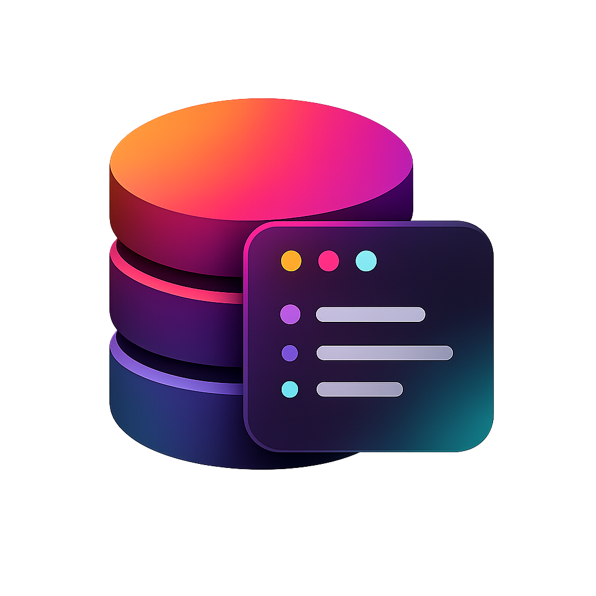

# Open Redis Web UI

> A web-based Redis manager you can run anywhere — browse, edit and manage Redis keys from your browser. No Electron, no desktop install required.

Built as a web port of the excellent [AnotherRedisDesktopManager](https://github.com/qishibo/AnotherRedisDesktopManager) desktop application.

<br>

---

## Features

- Connect to standalone, cluster, sentinel, and SSH-tunnelled Redis instances
- Tree-view key browser with virtual scrolling (handles millions of keys)
- View and edit all Redis types: String, Hash, List, Set, ZSet, Stream, ReJSON
- Multiple value viewers: JSON, Msgpack, Protobuf, Gzip, Brotli, Deflate, Base64, and more
- CLI console with command history and pub/sub monitor
- Dark mode and light mode
- Multiple simultaneous connections in tabs

---

## Running with Docker

No git clone or Node.js required — just Docker.

```bash
docker run -d \
  --name open-redis-web-ui \
  --restart unless-stopped \
  -p 9988:9988 \
  -v orwui-data:/app/data \
  --add-host=host.docker.internal:host-gateway \
  bhooteshwarrahul/open-redis-web-ui:latest
```

Then open [http://localhost:9988](http://localhost:9988) in your browser.

> The production image builds the Vite frontend at image-build time and serves the compiled assets via Express on port 9988. There is no separate dev server at runtime.

| Option                                      | Description                                                                                        |
| ------------------------------------------- | -------------------------------------------------------------------------------------------------- |
| `-p 9988:9988`                              | Expose the UI on port 9988. Change the left side to use a different host port, e.g. `-p 8080:9988` |
| `-v orwui-data:/app/data`                   | Persist saved connections across container restarts                                                |
| `--restart unless-stopped`                  | Auto-start the container on Docker/host boot                                                       |
| `--add-host=host.docker.internal:host-gateway` | Allows connecting to Redis on your host machine using `localhost` or `127.0.0.1` as the host. Required on Linux; Docker Desktop for Mac/Windows includes this automatically but it doesn't hurt to set it explicitly. |

### Stop / remove

```bash
docker stop open-redis-web-ui
docker rm open-redis-web-ui
```

---

## Development Setup

### Requirements

- Node.js >= 16
- npm >= 8

### Install & run

```bash
git clone https://github.com/qishibo/AnotherRedisDesktopManager.git
cd AnotherRedisDesktopManager

npm install

# Terminal 1 — API server with auto-reload
npm run server:dev

# Terminal 2 — Vite dev server with HMR
npm run dev
```

Open [http://localhost:19988](http://localhost:19988). The Vite dev server proxies `/api` and `/ws` to the Express server on port 9988.

### Multi-platform Docker build & push

Builds a single manifest covering `linux/amd64` and `linux/arm64` (e.g. Apple Silicon, AWS Graviton) and pushes it to Docker Hub.

**One-time setup — create a buildx builder that supports multi-platform builds:**

```bash
docker buildx create --name mp-builder --use
docker buildx inspect --bootstrap
```

**Build and push:**

```bash
docker buildx build \
  --platform linux/amd64,linux/arm64 \
  --tag bhooteshwarrahul/open-redis-web-ui:latest \
  --push \
  .
```

Tag a versioned release alongside `latest`:

```bash
VERSION=1.2.0
docker buildx build \
  --platform linux/amd64,linux/arm64 \
  --tag bhooteshwarrahul/open-redis-web-ui:${VERSION} \
  --tag bhooteshwarrahul/open-redis-web-ui:latest \
  --push \
  .
```

> Requires Docker Desktop >= 4.x or Docker Engine with the `buildx` plugin and QEMU emulation installed (`docker run --rm --privileged tonistiigi/binfmt --install all`).

---

## Architecture

```
browser
    │
    └──▶  Express server  (server/index.js)  ← serves built Vite assets + API
              │
              ├── /api/redis/*   — ioredis connection & command proxy
              └── /api/ssh/*     — SSH tunnel via tunnel-ssh
```

- **Frontend**: Vue 2, Element UI, vxe-table, Monaco editor
- **Backend**: Express, ioredis, tunnel-ssh
- **No Electron** — runs entirely in the browser against the local API server

---

## Credits

This project is a web-based adaptation of **[AnotherRedisDesktopManager](https://github.com/qishibo/AnotherRedisDesktopManager)** — a faster, better and more stable Redis desktop manager licensed under MIT.

The original desktop application supports Linux, Windows and macOS. This project lifts the core Redis logic and UI into a Node.js + browser architecture, removing the Electron dependency so it can be self-hosted and accessed from any browser.

---

## License

[MIT](LICENSE)

[THIRD_PARTY_NOTICES](THIRD_PARTY_NOTICES.md)
