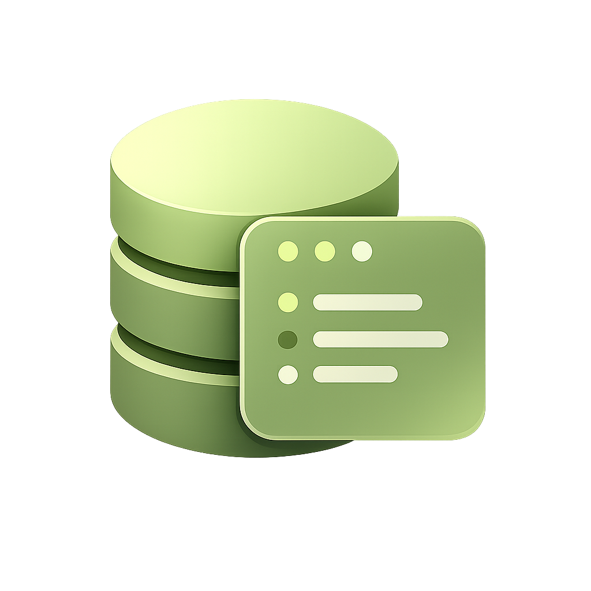
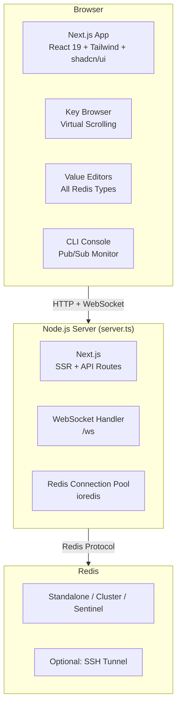

# Open Redis Web UI

> A web-based Redis manager you can run anywhere — browse, edit and manage Redis keys from your browser. No Electron, no desktop install required.

<br>

---

## Features

- Connect to standalone, cluster, sentinel, and SSH-tunnelled Redis instances
- Tree-view key browser with virtual scrolling (handles millions of keys)
- View and edit all Redis types: String, Hash, List, Set, ZSet, Stream, ReJSON
- Multiple value viewers: JSON, Msgpack, Protobuf, Gzip, Brotli, Deflate, Base64, and more
- CLI console with command history and pub/sub monitor
- Dark mode and light mode
- Multiple simultaneous connections in tabs

---

## Running with Docker

No git clone or Node.js required — just Docker.

```bash
docker run -d \
  --name open-redis-web-ui \
  --restart unless-stopped \
  -p 2604:2604 \
  -v open-redis-web-ui-data:/app/data \
  --add-host=host.docker.internal:host-gateway \
  bhooteshwarrahul/open-redis-web-ui:latest
```

Then open [http://localhost:2604](http://localhost:2604) in your browser.

| Option                                         | Description                                                                                                                                                                                                           |
| ---------------------------------------------- | --------------------------------------------------------------------------------------------------------------------------------------------------------------------------------------------------------------------- |
| `-p 2604:2604`                                 | Expose the UI on port 2604. Change the left side to use a different host port, e.g. `-p 8080:2604`                                                                                                                    |
| `-v open-redis-web-ui-data:/app/data`          | Persist saved connections across container restarts                                                                                                                                                                   |
| `--restart unless-stopped`                     | Auto-start the container on Docker/host boot                                                                                                                                                                          |
| `--add-host=host.docker.internal:host-gateway` | Allows connecting to Redis on your host machine using `localhost` or `127.0.0.1` as the host. Required on Linux; Docker Desktop for Mac/Windows includes this automatically but it doesn't hurt to set it explicitly. |

### Stop / remove

```bash
docker stop open-redis-web-ui
docker rm open-redis-web-ui
```

---

## Development Setup

### Requirements

- Node.js >= 16
- npm >= 8

### Install & run

```bash
npm install
npm run dev
```

Open [http://localhost:2604](http://localhost:2604).

### Multi-platform Docker build & push

Builds a single manifest covering `linux/amd64` and `linux/arm64` (e.g. Apple Silicon, AWS Graviton) and pushes it to Docker Hub.

**One-time setup — create a buildx builder that supports multi-platform builds:**

```bash
docker buildx create --name mp-builder --use
docker buildx inspect --bootstrap
```

**Build and push:**

```bash
docker buildx build \
  --platform linux/amd64,linux/arm64 \
  --tag bhooteshwarrahul/open-redis-web-ui:latest \
  --push \
  .
```

Tag a versioned release alongside `latest`:

```bash
VERSION=1.2.0
docker buildx build \
  --platform linux/amd64,linux/arm64 \
  --provenance=false \
  --tag bhooteshwarrahul/open-redis-web-ui:${VERSION} \
  --tag bhooteshwarrahul/open-redis-web-ui:latest \
  --push \
  .
```

> Requires Docker Desktop >= 4.x or Docker Engine with the `buildx` plugin and QEMU emulation installed (`docker run --rm --privileged tonistiigi/binfmt --install all`).

---

## Architecture


```mermaid
graph TB
    subgraph Browser
        A[Next.js App<br/>React 19 + Tailwind + shadcn/ui]
        B[Key Browser<br/>Virtual Scrolling]
        C[Value Editors<br/>All Redis Types]
        D[CLI Console<br/>Pub/Sub Monitor]
    end

    subgraph Server["Node.js Server (server.ts)"]
        E[Next.js<br/>SSR + API Routes]
        F[WebSocket Handler<br/>/ws]
        G[Redis Connection Pool<br/>ioredis]
    end

    subgraph Redis
        H[Standalone / Cluster / Sentinel]
        I[Optional: SSH Tunnel]
    end

    Browser -->|HTTP + WebSocket| Server
    Server -->|Redis Protocol| Redis
```
